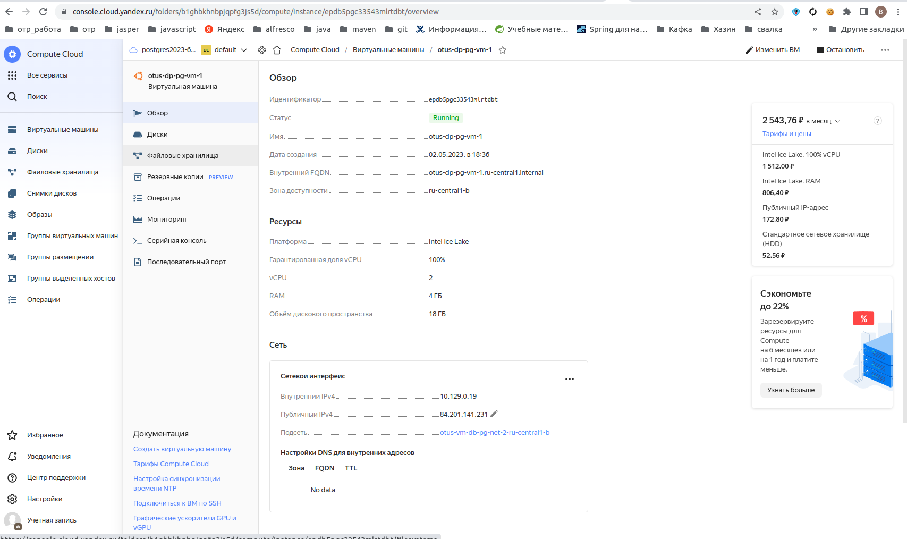
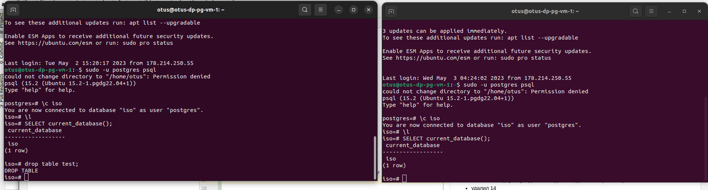
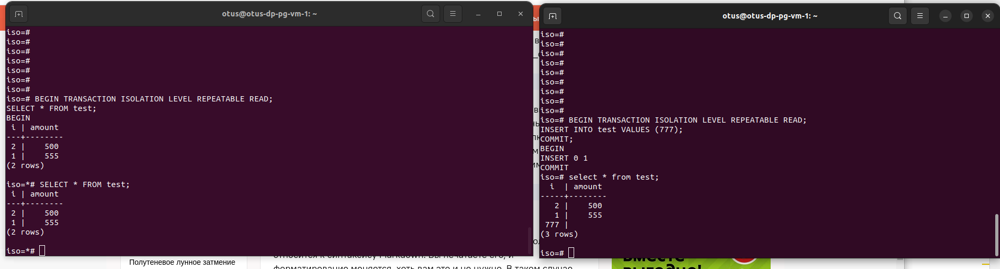
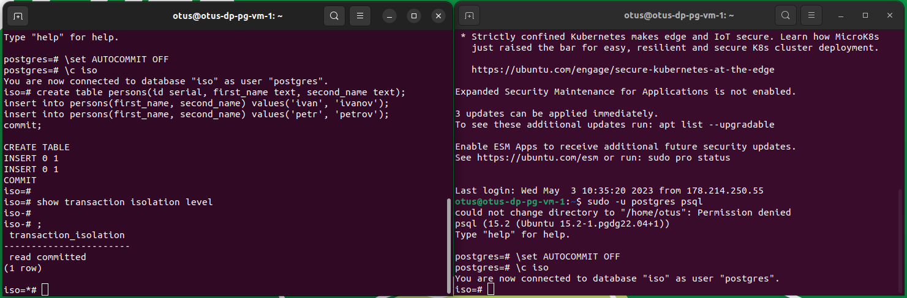
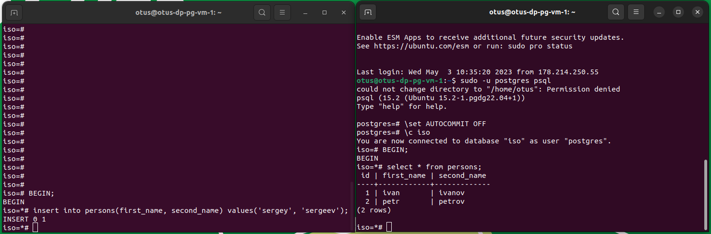
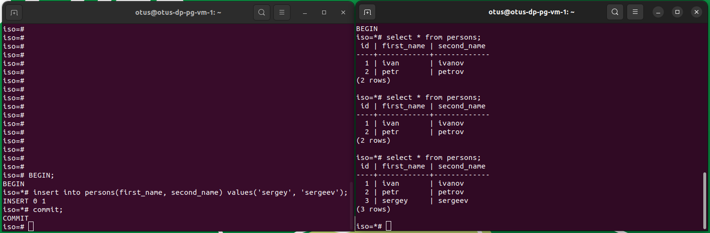
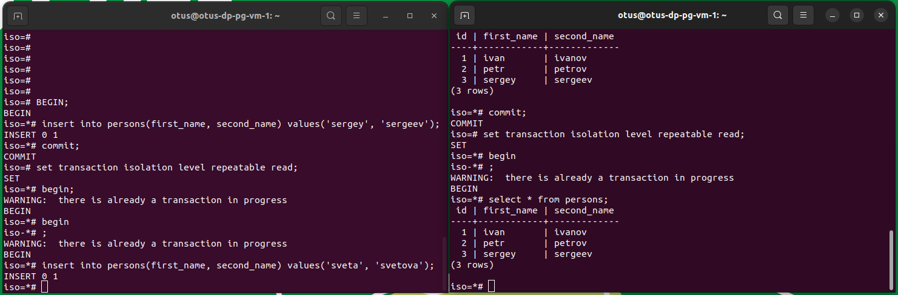
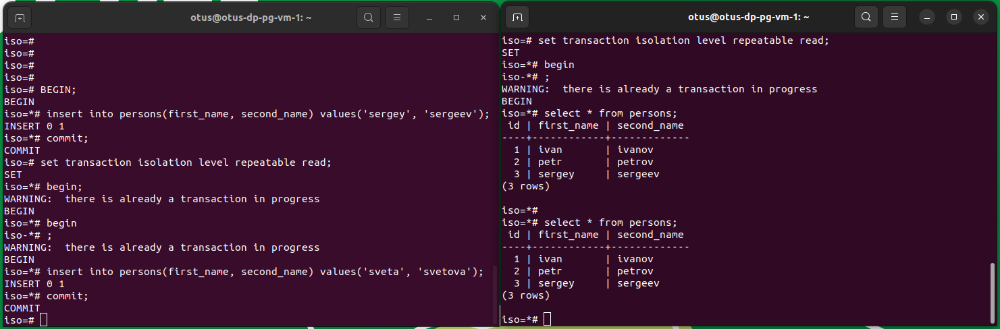
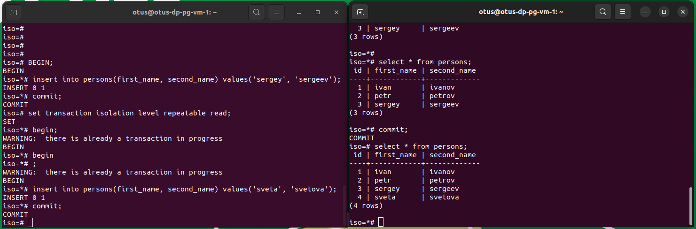

# otus_dp_pg
урок по проверке уровней транзакции

# Создание виртуальной машины
- зашел на console.cloud.yandex.ru
- создал платежный аккаунт
- привязал к нему  виртуальную карту
- создал виртуальную машину. 
- для связи использовал сгенерированный rsa ключ
машина создалась для убунты 22
  ssh -i ~/.ssh/yc_key otus@158.160.29.167
- 
- запустил установку постгресса 
установился 14 сразу.
- поставил сверху 15 
увидел что поднялось два кластера постгресса
- удалил 14 

## Проведение тестирования разных уровней транзакции

- подключился к бд с двух терминалов
  
### test TRANSACTION ISOLATION LEVEL READ COMMITTED;
- 
### test TRANSACTION ISOLATION LEVEL REPEATABLE READ;
- 
### test TRANSACTION ISOLATION LEVEL SERIALIZABLE;
- 

Машину после использования положил

## Выполнение по ДЗ
- подключился к бд с двух терминалов
- выключен автокоммит, создана и заполнена таблица, проверен текущий уровень изоляции транзакции
  
- в первой сессии добавили строку. без фиксации транзакции.
  во второй сессии данная строка не видна. Вставленная строка не будет видна из-за уровня изоляции транзакции, пока не будет транзакция зафиксирована.
  
  после завершения транзакции данные видны во второй сессии.
   
  что соответвует уровню изоляции транзакции. Разрешено чтение закоммиченных данных.
- во обоих  сессиях стартовал транзакции уровня repeatable read
  в первой сессии добавил строку.
  во второй сессии строка не видна
  
  что соответсвует уровню изоляции транзакции, так как транзакция не закончена.
  при фиксации транзакции в первой сессии во второй сессии добавленная запись не видна
  
  так как при таком уровне изоляции транзакции все данные, измененные после начала транзации, во второй сессии не будут в ней видны.
  После завершения транзакции во второй сессии данные становятся доступными. *Своего рода версионность данных*
 
