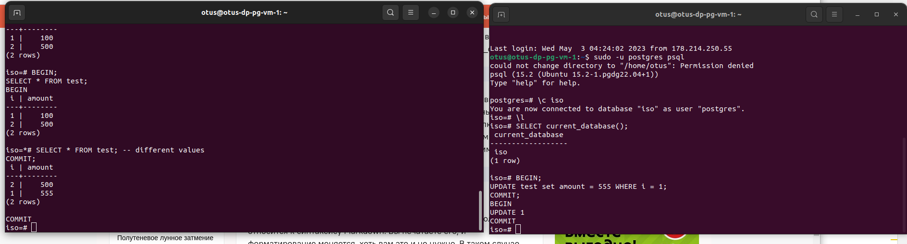

# otus_dp_pg
урок по проверке уровней транзакции

# Создание виртуальной машины
- зашел на console.cloud.yandex.ru
- создал платежный аккаунт
- привязал к нему  виртуальную карту
- создал виртуальную машину. 
- для связи использовал сгенерированный rsa ключ
машина создалась для убунты 22
  ssh -i ~/.ssh/yc_key otus@158.160.29.167
- 
- запустил установку постгресса 
установился 14 сразу.
- поставил сверху 15 
увидел что поднялось два кластера постгресса
- удалил 14 

## Проведение тестирования разных уровней транзакции

- подключился к бд с двух терминалов
  
### test TRANSACTION ISOLATION LEVEL READ COMMITTED;
- 
### test TRANSACTION ISOLATION LEVEL REPEATABLE READ;
- 
### test TRANSACTION ISOLATION LEVEL SERIALIZABLE;
- 

Машину после использования положил
