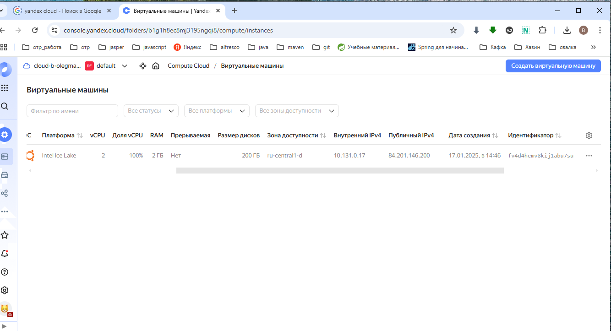
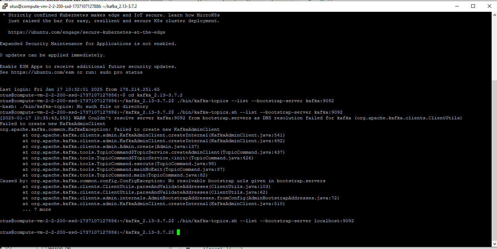
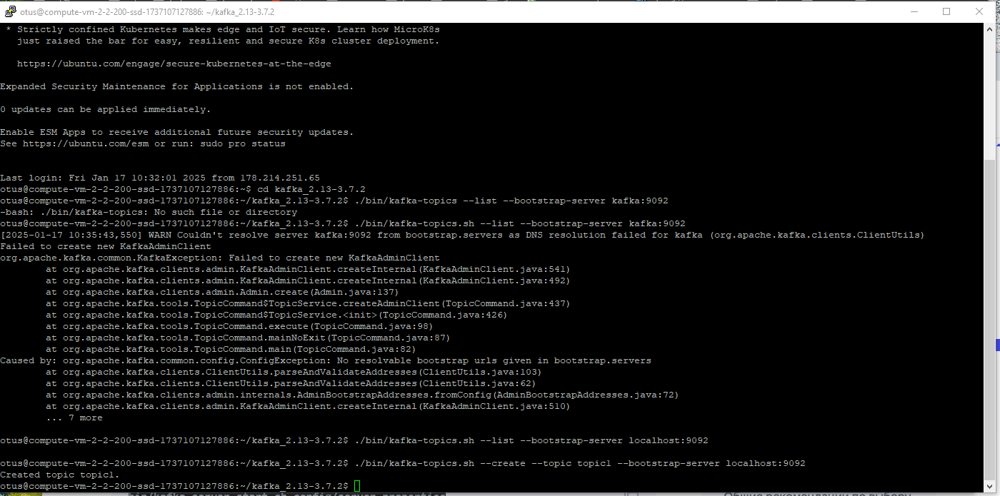
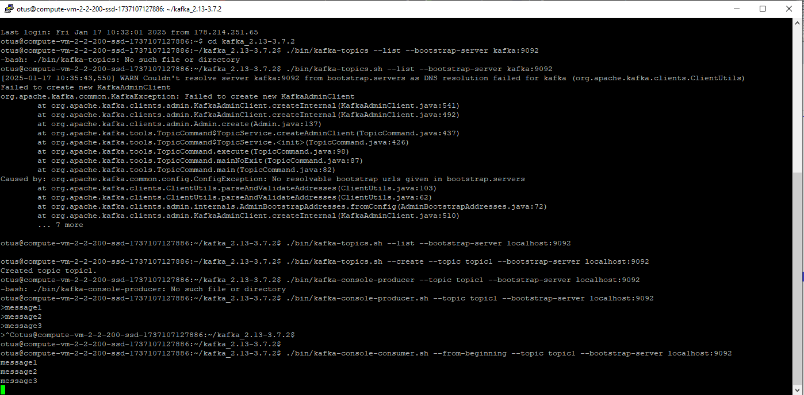

# otus_kafka
урок по самостоятельному развертыванию кафки

# Создание виртуальной машины
машина создалась для убунты 22
ssh -i ~/.ssh/yc_key otus@158.160.29.167
- 
- выполняю  
  sudo apt update
  sudo apt upgrade
  sudo apt install default-jre
  sudo apt install default-jdk
  wget https://downloads.apache.org/kafka/3.7.2/kafka_2.13-3.7.2.tgz
  tar xzf kafka_2.13-3.7.0.tgz
  cd kafka_2.13-3.7.2
  ./bin/zookeeper-server-start.sh config/zookeeper.properties
  в новой коннекции
  cd kafka_2.13-3.7.2
  ./bin/kafka-server-start.sh config/server.properties
  в новой коннекции
- проверил список топиков
  ./bin/kafka-topics.sh --list --bootstrap-server localhost:9092
 
- создал топик 
./bin/kafka-topics.sh --create --topic topic1 --bootstrap-server localhost:9092

- проверка записи и чтения в топики
  
