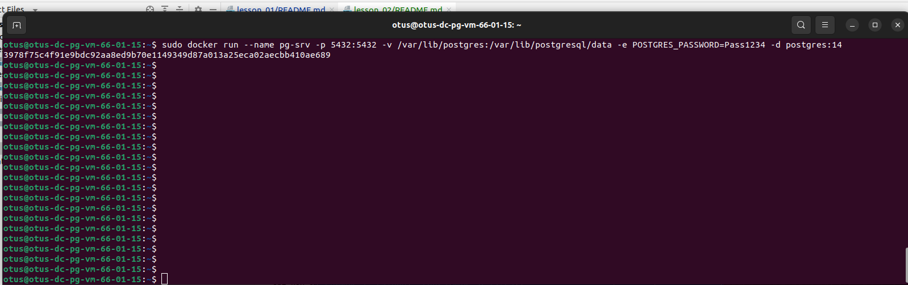

# otus_dp_pg
урок по проверке уровней транзакции

# Создание виртуальной машины
- зашел на console.cloud.yandex.ru
- создал платежный аккаунт
- привязал к нему  виртуальную карту
- создал виртуальную машину. 
- для связи использовал сгенерированный rsa ключ
машина создалась для убунты 22
  ssh -i ~/.ssh/yc_key otus@158.160.29.167
- 

## Установка Docker

- подключился к виртуальной машине 
  выполнил:
  sudo apt update
  sudo apt install curl software-properties-common ca-certificates apt-transport-https -y
  curl -f -s -S -L https://download.docker.com/linux/ubuntu/gpg | sudo apt-key add -
  sudo add-apt-repository "deb [arch=amd64] https://download.docker.com/linux/ubuntu jammy stable"
  apt-cache policy docker-ce

  
## Установка в докер постгресс
- 
### Создал папку /var/lib/postgres
   sudo mkdir -p /var/lib/postgres
   Важно! папка должна иметь хозяина lxd иначе докер не может смапировать
### развернул контейнер с PostgreSQL 14 смонтировав в него /var/lib/postgres
- 
### подключился с контейнеру с локальной машины.
- 
### проверка соединения.
- 
### создал тестовую таблицу.
- 
### список запущенных контейнеров.
- 
### остановил и удалил контейнер.
- 
### стартовал контейнер смонтировав в него  /var/lib/postgres
- 
### подключился с контейнеру с локальной машины.
- 

Машину после использования положил
