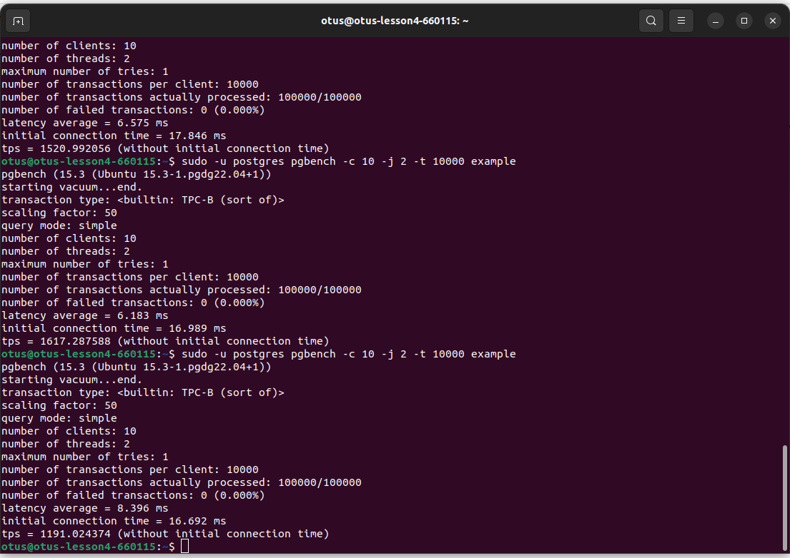

# otus_dp_pg
урок по проверке уровней транзакции

# Создание виртуальной машины
- зашел на console.cloud.yandex.ru
- создал платежный аккаунт
- привязал к нему  виртуальную карту
- создал виртуальную машину. 
- для связи использовал сгенерированный rsa ключ
машина создалась для убунты 22
  ssh -i ~/.ssh/yc_key otus@158.160.29.167
- 

## Вторая часть ДЗ

- подключился к виртуальной машине 
  установил постгресс:
  sudo apt update && sudo apt upgrade -y && sudo sh -c 'echo "deb http://apt.postgresql.org/pub/repos/apt $(lsb_release -cs)-pgdg main" > /etc/apt/sources.list.d/pgdg.list' && wget --quiet -O - https://www.postgresql.org/media/keys/ACCC4CF8.asc | sudo apt-key add - && sudo apt-get update && sudo apt-get -y install postgresql-15
  
- создал БД example
- установил на эту бд таблицы pgbench
  
- проверил производительность с установками по умолчанию
  
  
  592 транзакции в секунду
- увеличил вдвое shared Buffers
  
  
  754 транзакции в секунду
- установил shared Buffers в 1/3 свободной памяти
  
  
  
  1191 транзакция в секунду
- увеличил количество коннекций
  
  
  1520 транзакций в секунду
- увеличил количество коннекций
  
  
  1670 транзакций в секунду
- изменил work_mem
  
  
  
  1191 транзакций в секунду

- изменил work_mem
  
  
  1319 транзакций в секунду
- изменил work_mem
  
  
  1449 транзакций в секунду

Машину после использования положил
