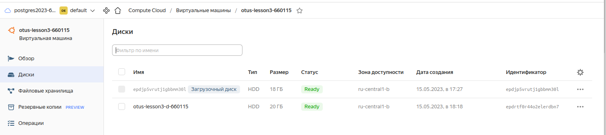

# otus_dp_pg
урок по проверке уровней транзакции

# Создание виртуальной машины
- зашел на console.cloud.yandex.ru
- создал платежный аккаунт
- привязал к нему  виртуальную карту
- создал виртуальную машину. 
- для связи использовал сгенерированный rsa ключ
машина создалась для убунты 22
  ssh -i ~/.ssh/yc_key otus@158.160.29.167
- 
подключил второй диск
- 

## Вторая часть ДЗ

- подключился к виртуальной машине 
  установил постгресс:
  sudo apt update && sudo apt upgrade -y && sudo sh -c 'echo "deb http://apt.postgresql.org/pub/repos/apt $(lsb_release -cs)-pgdg main" > /etc/apt/sources.list.d/pgdg.list' && wget --quiet -O - https://www.postgresql.org/media/keys/ACCC4CF8.asc | sudo apt-key add - && sudo apt-get update && sudo apt-get -y install postgresql-15
  
- создал таблицу 
  
### Проверка работы с внешним диском
- смонтировал диск
  sudo mount -o defaults /dev/vdb1 /mnt/data
  
- переместил на него данные постгресса
  chown -R postgres:postgres /mnt/data/
  mv /var/lib/postgresql/15 /mnt/data
- 
### поправил файл настройки /etc/postgresql/15/main/posgresql.conf
- 
### старт с поправленными настройками
- 

Машину после использования положил
