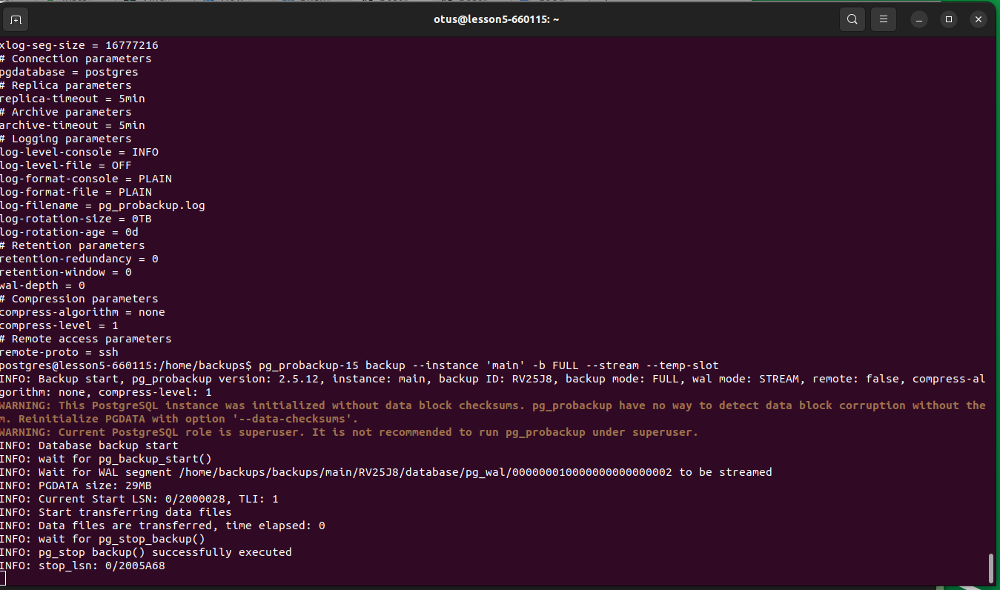
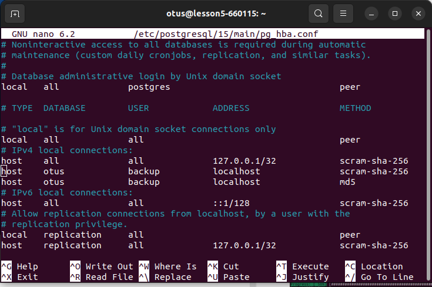

# otus_dp_pg
урок по созданию бэкапа и восстановлению из него.

# Создание виртуальной машины
- зашел на console.cloud.yandex.ru
- создал платежный аккаунт
- привязал к нему  виртуальную карту
- создал виртуальную машину. 
- для связи использовал сгенерированный rsa ключ
машина создалась для убунты 22
  ssh -i ~/.ssh/yc_key otus@158.160.29.167
- 

## Вторая часть ДЗ

- подключился к виртуальной машине 
  установил постгресс:
  sudo apt update && sudo DEBIAN_FRONTEND=noninteractive apt upgrade -y -q && sudo sh -c 'echo "deb http://apt.postgresql.org/pub/repos/apt $(lsb_release -cs)-pgdg main" > /etc/apt/sources.list.d/pgdg.list' && wget --quiet -O - https://www.postgresql.org/media/keys/ACCC4CF8.asc | sudo apt-key add - && sudo apt-get update && sudo DEBIAN_FRONTEND=noninteractive apt -y install postgresql-15
  обновляются пакеты линукса
  

- установка pg_probackup
  

- помучавшись со скриптами, наконец выполняю скрипт для инициализации pg_probackup и инциализирую каталог хранения
  
- проверил что каталоги создались
  
- проверим конфигурацию
  
- запустил первый полный бэкап
  

  указано, что не включена контрольная сумма
- включил контрольную сумму
  
- проверил что бэкап появился
  
- делаем настройку для отключения запроса пароля при фоновом формировании бэкапа, заодно добавлю бд 
  

- при добавлении новой бд необходимо предоставлять права
  
  прописал права на подключение
  
  
  проверил права
- сделал бэкап с дополнительной бд
  
- однако все еще требует пароль, хотя прописано
  
  сделал не тривиальную настройку пароля. Вспомнил что ментор говорил на лекции, тогда не удивило, сейчас поразило.
  
  удивительно, но пароль больше не просит. Страннный артефакт
  
- получил список бэкапов
  
- делаю восстановление бэкапа на второй кластер
  
- проверяю что бэкап успешно восстановился
  
 
 
общие замечания:
1. делать нужно внимательно. Малейшая ошибка и ничего не работает. 
2. сообщения не всегда информативны.
3. что приводит в замешательство - наличие странных артефактов.
4. очень жесткая привязка сценариев к версии бд

Машину после использования положил
