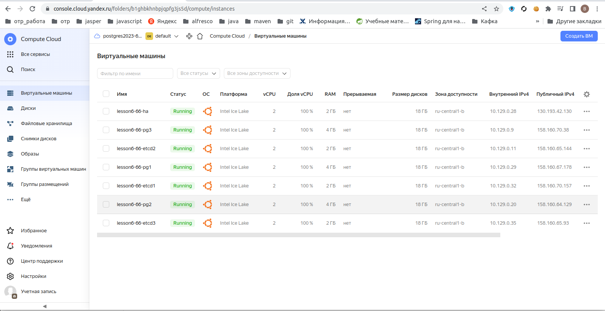
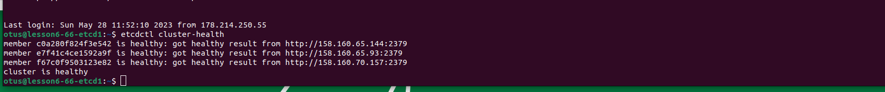
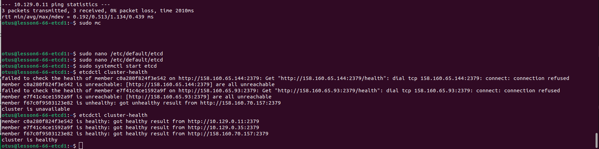
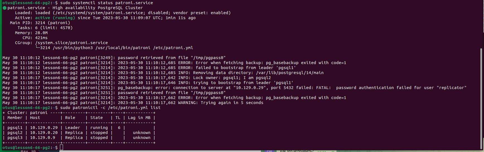
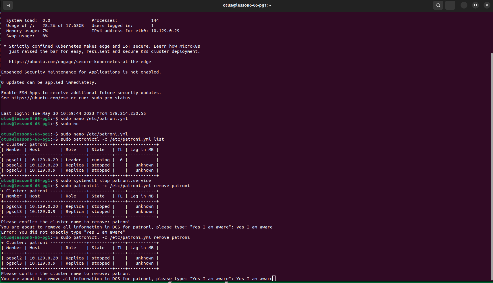
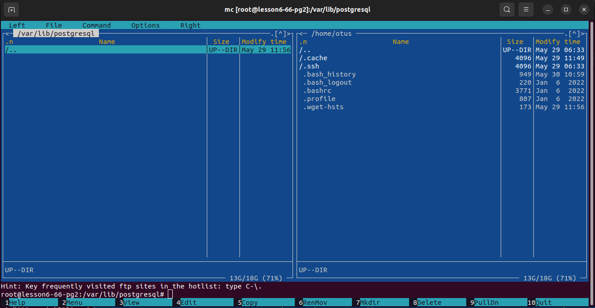
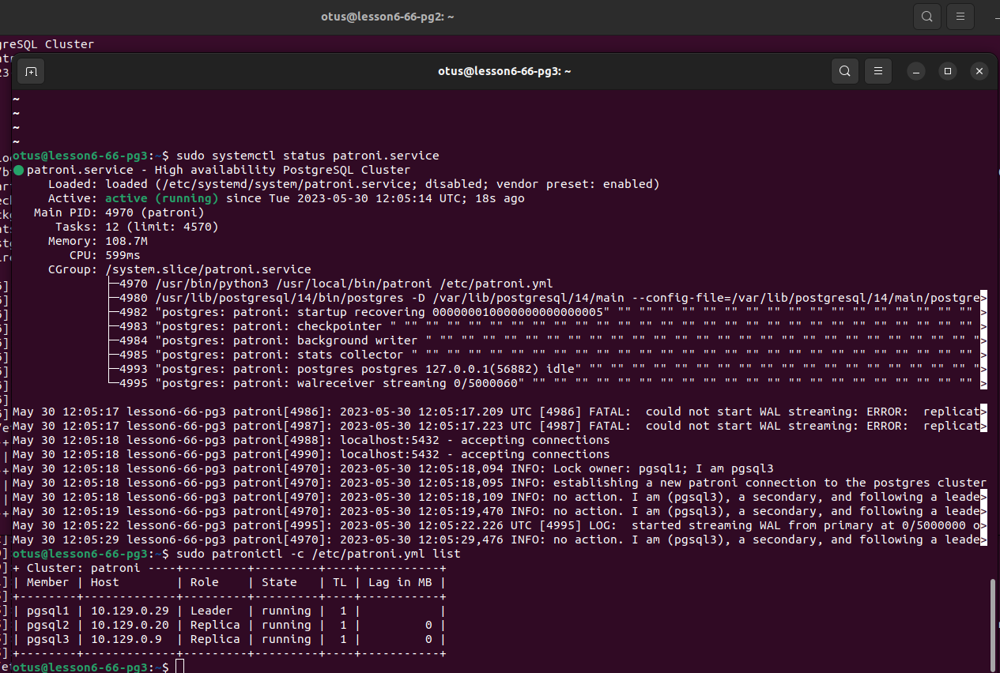
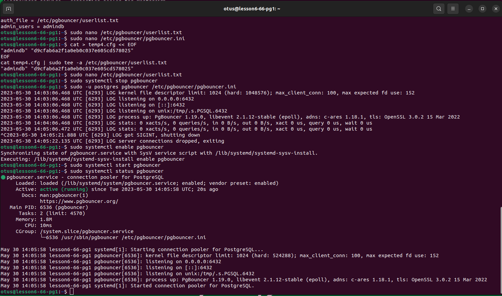
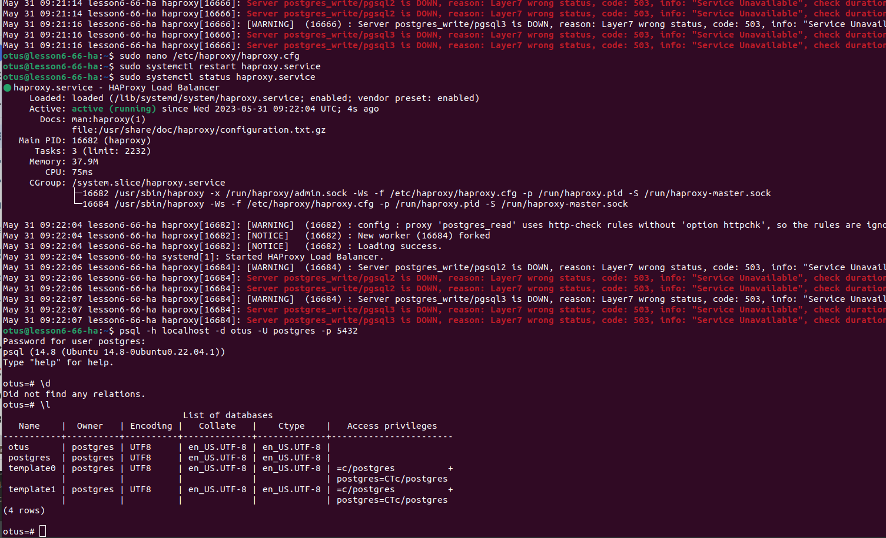

# otus_dp_pg
урок по созданию бэкапа и восстановлению из него.

# Создание виртуальной машины
- зашел на console.cloud.yandex.ru
- создал платежный аккаунт
- привязал к нему  виртуальную карту
- создал 7 виртуальных машин. 
- для связи использовал сгенерированный rsa ключ
машины создалась для убунты 22
  ssh -i ~/.ssh/yc_key otus@158.160.29.167
- 

## Вторая часть ДЗ
  

- установил etcd 
  настроил на внешние ip адреса
  
  настроил на внутренние ip адреса
  

- установка patroni
  первая установка patroni
  
  не удача, связана с тем что поднял кластер на уже имеющийся, а не создал с нуля 
- вторая попытка
  удаляю кластер
  
- удалил все старые файлы
  
- запустил снова
  
  все запустилось. Помощь оказал Авдонин Алексей.   
- установил pgbauncer
  
- на выделенную машину поставил HAProxy
  
  проверил соединение
 
