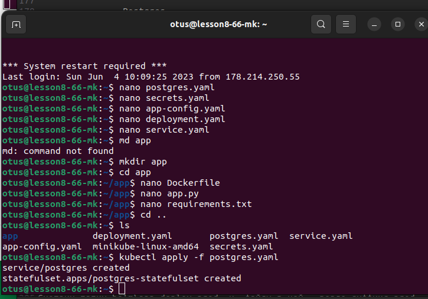

# otus_dp_pg
урок по созданию бэкапа и восстановлению из него.

# Создание виртуальной машины
- зашел на console.cloud.yandex.ru
- создал платежный аккаунт
- привязал к нему  виртуальную карту
- создал виртуальную машину. 
- для связи использовал сгенерированный rsa ключ
машины создалась для убунты 22
  ssh -i ~/.ssh/yc_key otus@158.160.29.167
- 

## Вторая часть ДЗ
  

- установил minikube
  по алгоритму описанному в install_minikube_on_ubuntu_22_on_cloud.adoc
- установил postgres
  
  
  
- однако в ДЗ надо было установить postgres 14
  поправил в описании контейнера в файле posgtres.yaml
  с
  - name: postgres
   image: postgres:latest
  на 
  - name: postgres
    image: postgres:14

  удалил контейнер, точку монтирования, запрос на точку монтирования, 
  пробую запустить : ошибка.
  

  лог старта пода:
PostgreSQL Database directory appears to contain a database; Skipping initialization
2023-06-04 16:25:54.046 UTC [1] FATAL:  database files are incompatible with server
2023-06-04 16:25:54.046 UTC [1] DETAIL:  The data directory was initialized by PostgreSQL version 15, which is not compatible with this version 14.8 (Debian 14.8-1.pgdg110+1).

  удалил вручную весь каталог с файлами постгресса.
  стартовал.
  
  

 
