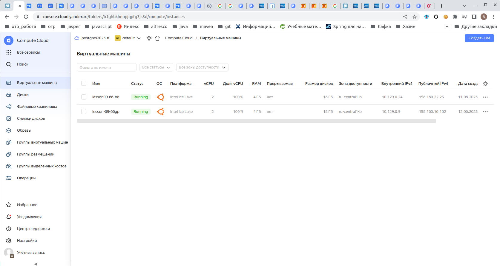
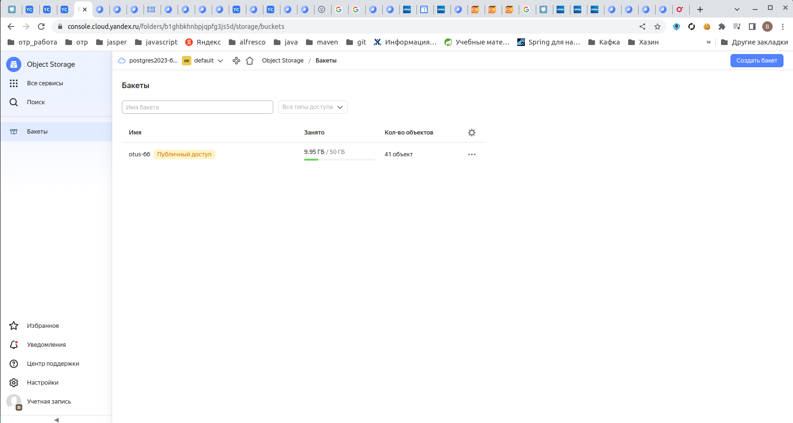

# otus_dp_pg
урок по созданию бэкапа и восстановлению из него.

# Создание виртуальной машины
- зашел на console.cloud.yandex.ru
- создал платежный аккаунт
- привязал к нему  виртуальную карту
- создал виртуальную машину. 
- для связи использовал сгенерированный rsa ключ
машины создалась для убунты 22
  ssh -i ~/.ssh/yc_key otus@158.160.29.167
- 
создал 2 машины, одна под посгресс
другая под гринплам.
так же создал хранилище s3
- 

## Вторая часть ДЗ
  

подключил к обоим машинам бакет по алгоритму:

mkdir s3fs
sudo apt install s3fs
echo YCAJEY5DWxHftzfoi8WByoDCH:YCPIID_3XfPCIBspudDQ6hfT7oNYwN7iEO3y-TQ2 > ~/.passwd-s3fs
chmod 600 ~/.passwd-s3fs
s3fs otus-66 $HOME/s3fs -o passwd_file=$HOME/.passwd-s3fs -o url=https://storage.yandexcloud.net -o use_path_request_style -o dbglevel=info -f -o curldbg

далее на первую машину установил пострегрес 14

залил данные с помощью pgloader

sudo apt install pgloader
sudo -u postgres pgloader --type csv --field "unique_key, taxi_id, trip_start_timestamp, trip_end_timestamp, trip_seconds, trip_miles, pickup_census_tract, dropoff_census_tract, pickup_community_area, dropoff_community_area, fare, tips, tolls, extras, trip_total, payment_type, company, pickup_latitude, pickup_longitude, pickup_location, dropoff_latitude, dropoff_longitude, dropoff_location" --with truncate --with "fields terminated by ','" -L /var/lib/postgresql/lader.log /var/lib/postgresql/import/taxi.csv.000000000000 postgres:///postgres?tablename=taxi_trips2

далее на вторую машину установил докер

sudo apt-get install docker-ce docker-ce-cli containerd.io docker-buildx-plugin docker-compose-plugin

установил пробный контейнер гп

sudo docker pull docker.io/vldbuk/gpdb_demo_repo:gpdb_demo
sudo docker images
sudo docker container run -ti -d --privileged=true -p 5432:5432 -v /home/otus/fss3:/load docker.io/vldbuk/gpdb_demo_repo:gpdb_demo "/usr/lib/systemd/systemd"
зашел в контейнер
sudo docker exec -it 7aea66f63172 bash
в контейнере запустил гп
su gpadmin
gpstart -qa
psql -d demo

создал таблицу в гп:
create table taxi_trips2 (
unique_key varchar(50),
taxi_id varchar(130),
trip_start_timestamp TIMESTAMP,
trip_end_timestamp TIMESTAMP,
trip_seconds bigint,
trip_miles double precision,
pickup_census_tract bigint,
dropoff_census_tract bigint,
pickup_community_area bigint,
dropoff_community_area bigint,
fare double precision,
tips double precision,
tolls double precision,
extras double precision,
trip_total double precision,
payment_type varchar(40),
company varchar(40),
pickup_latitude double precision,
pickup_longitude double precision,
pickup_location varchar(120),
dropoff_latitude double precision,
dropoff_longitude double precision,
dropoff_location varchar(120)
) distributed by (payment_type);

* замечание поля с переменной длиннной гп не поддерживает.
   тестовый гп основан на постгрессе9.2

запустил утилиту загрузки
gpfdist -d /load/ -p 8081 > /load/gpfdist.log 2>&1 &
создал таблицу ссылающуюся на внешние данные
CREATE READABLE EXTERNAL TABLE taxi_trips_ext (like taxi_trips)
LOCATION ('gpfdist://127.0.0.1:8081/taxi.csv.000000000000')
FORMAT 'csv' (header)
LOG ERRORS SEGMENT REJECT LIMIT 50 rows;

загрузил данные
INSERT INTO taxi_trips SELECT * from taxi_trips_ext;

проверил скорость выборки:
гп:
demo=# SELECT payment_type, sum(tips)/sum(trip_total)*100 + 0 as tips_percent, count(*) as c
demo-# FROM taxi_trips
demo-# group by payment_type
demo-# order by 3;
payment_type |    tips_percent    |   c    
--------------+--------------------+--------
Mobile       |   15.0134169505834 |     27
Prcard       |  0.892090172497852 |    164
Pcard        |   4.19424557611779 |    375
Credit Card  |   17.4994106311795 | 239389
Cash         | 0.0540734702129898 | 428863
(5 rows)

Time: 253.726 ms

пг:
postgres=# SELECT payment_type, sum(tips)/sum(trip_total)*100 + 0 as tips_percent, count(*) as c
FROM taxi_trips
group by payment_type
order by 3;
payment_type |      tips_percent       |   c    
--------------+-------------------------+--------
Mobile       | 15.01341695058341122200 |     27
Prcard       |  0.89209017249785248300 |    164
Pcard        |  4.19424557611779008500 |    375
Credit Card  | 17.49941063118071227800 | 239389
Cash         |  0.05407347033043374800 | 428862
(5 rows)

Time: 297.858 ms

для проверки создал колоночную таблицу
create table taxi_trips3 (
unique_key varchar(50),
taxi_id varchar(130),
trip_start_timestamp TIMESTAMP,
trip_end_timestamp TIMESTAMP,
trip_seconds bigint,
trip_miles double precision,
pickup_census_tract bigint,
dropoff_census_tract bigint,
pickup_community_area bigint,
dropoff_community_area bigint,
fare double precision,
tips double precision,
tolls double precision,
extras double precision,
trip_total double precision,
payment_type varchar(40),
company varchar(40),
pickup_latitude double precision,
pickup_longitude double precision,
pickup_location varchar(120),
dropoff_latitude double precision,
dropoff_longitude double precision,
dropoff_location varchar(120)
) WITH (
appendonly = true,
orientation = column,
compresstype = zstd,
compresslevel = 1
);
demo=# \timing
Timing is on.
demo=# SELECT payment_type, sum(tips)/sum(trip_total)*100 + 0 as tips_percent, count(*) as c
demo-# FROM taxi_trips3
demo-# group by payment_type
demo-# order by 3;
payment_type |    tips_percent    |   c    
--------------+--------------------+--------
Mobile       |   15.0134169505834 |     27
Prcard       |  0.892090172497852 |    164
Pcard        |   4.19424557611779 |    375
Credit Card  |   17.4994106311795 | 239389
Cash         | 0.0540734702129898 | 428863
(5 rows)

Time: 210.562 ms

время стабильное и не зависит  от количества обращений.

 
