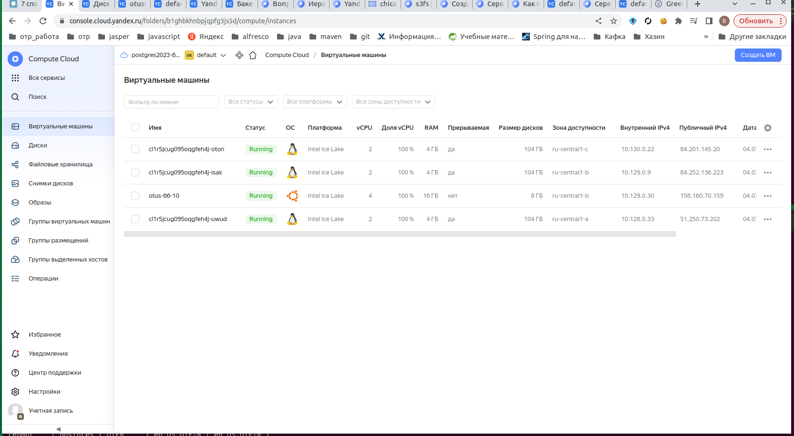
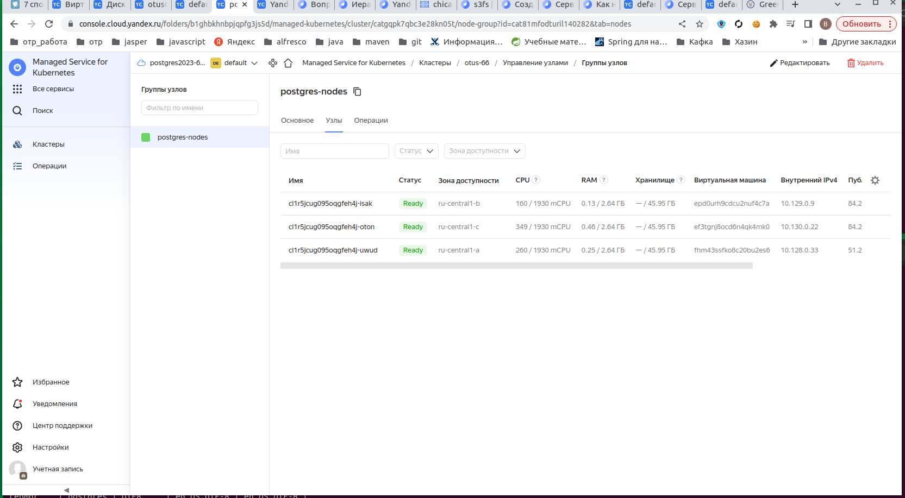
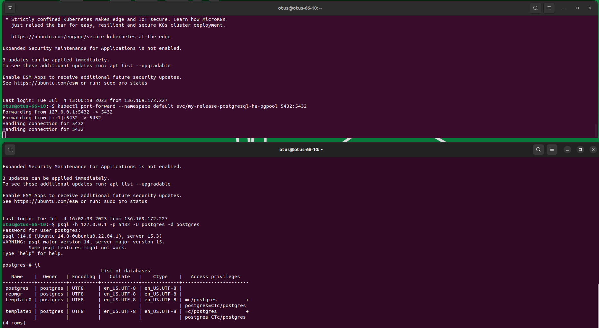
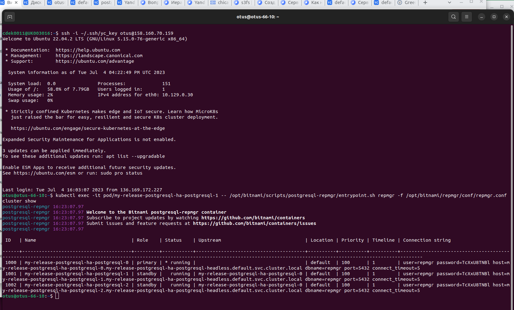
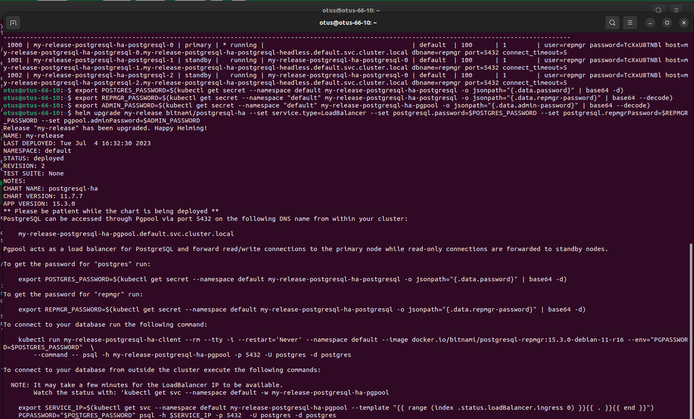
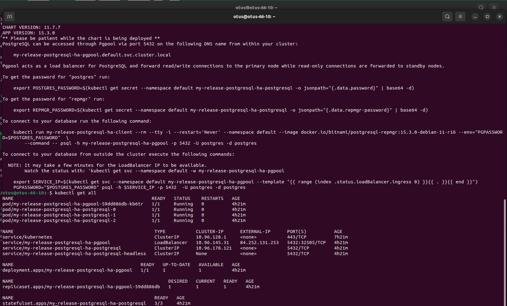
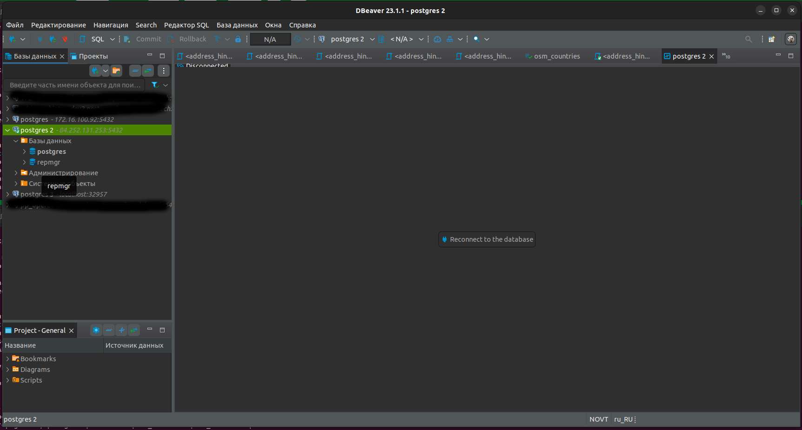

# otus_dp_pg
урок по созданию бэкапа и восстановлению из него.

# Создание кластера
- зашел на console.cloud.yandex.ru
  создал в ui кластер кубер с тремя подами otus-66.
- создал виртуальную машину для управления кластером.
  установил на нее yc
  curl -sSL https://storage.yandexcloud.net/yandexcloud-yc/install.sh | bash
  exit
  yc init
  выход нужен что бы применились настройки
- установил на управляющую машину управление кластером кубера
  sudo apt-get update && sudo apt-get install -y apt-transport-https
  curl -s https://packages.cloud.google.com/apt/doc/apt-key.gpg | sudo apt-key add -
  echo "deb https://apt.kubernetes.io/ kubernetes-xenial main" | sudo tee -a /etc/apt/sources.list.d/kubernetes.list
  sudo apt-get update
  sudo apt-get install -y kubectl
- прописал в управление кластером свой кластер
  yc managed-kubernetes cluster get-credentials otus-66 --external
  kubectl config view
- 
- 
- проверка что все работает
  yc container cluster list 
  все должно быть без ошибок
  проверка состояния кластера
  kubectl get all
- установка шаблонизатора helm
  curl https://baltocdn.com/helm/signing.asc | gpg --dearmor | sudo tee /usr/share/keyrings/helm.gpg > /dev/null
  sudo apt-get install apt-transport-https --yes
  echo "deb [arch=$(dpkg --print-architecture) signed-by=/usr/share/keyrings/helm.gpg] https://baltocdn.com/helm/stable/debian/ all main" | sudo tee /etc/apt/sources.list.d/helm-stable-debian.list
  sudo apt-get update
  sudo apt-get install helm

- используя шаблонизатор и преднастроенный сценарий от компании bitnami создадим на кластере кластер постгресса высокой доступности в кубернетисе
  helm repo add bitnami https://charts.bitnami.com/bitnami
  helm repo update
  helm install my-release bitnami/postgresql-ha

- после разворачивания кластера постгресса выдается информация о способах взаимодействия:

NAME: my-release
LAST DEPLOYED: Tue Jul  4 12:11:25 2023
NAMESPACE: default
STATUS: deployed
REVISION: 1
TEST SUITE: None
NOTES:
CHART NAME: postgresql-ha
CHART VERSION: 11.7.7
APP VERSION: 15.3.0
** Please be patient while the chart is being deployed **
PostgreSQL can be accessed through Pgpool via port 5432 on the following DNS name from within your cluster:

    my-release-postgresql-ha-pgpool.default.svc.cluster.local

Pgpool acts as a load balancer for PostgreSQL and forward read/write connections to the primary node while read-only connections are forwarded to standby nodes.

To get the password for "postgres" run:

    export POSTGRES_PASSWORD=$(kubectl get secret --namespace default my-release-postgresql-ha-postgresql -o jsonpath="{.data.password}" | base64 -d)

To get the password for "repmgr" run:

    export REPMGR_PASSWORD=$(kubectl get secret --namespace default my-release-postgresql-ha-postgresql -o jsonpath="{.data.repmgr-password}" | base64 -d)

To connect to your database run the following command:

    kubectl run my-release-postgresql-ha-client --rm --tty -i --restart='Never' --namespace default --image docker.io/bitnami/postgresql-repmgr:15.3.0-debian-11-r16 --env="PGPASSWORD=$POSTGRES_PASSWORD"  \
        --command -- psql -h my-release-postgresql-ha-pgpool -p 5432 -U postgres -d postgres

To connect to your database from outside the cluster execute the following commands:

    kubectl port-forward --namespace default svc/my-release-postgresql-ha-pgpool 5432:5432 &
    psql -h 127.0.0.1 -p 5432 -U postgres -d postgres

- на управляющей машине можно пробросить порты
  kubectl port-forward --namespace default svc/my-release-postgresql-ha-pgpool 5432:5432
  и подключиться в другой сессии на управляющей машине к кластеру постгресса
  psql -h 127.0.0.1 -p 5432 -U postgres -d postgres
- 
- проверил падение, переключение, восстановление подов
  kubectl delete pod/my-release-postgresql-ha-postgresql-0
  при падении мастера коннект к кластеру теряется и идет переконнект.
- так как это кластер постгресса, то в сценарии есть установка repmgr и можно получить доступ к нему зайдя на мастер под
  kubectl exec -it pod/my-release-postgresql-ha-postgresql-1 -- /opt/bitnami/scripts/postgresql-repmgr/entrypoint.sh repmgr -f /opt/bitnami/repmgr/conf/repmgr.conf cluster show
- 
- кластер извне не доступен, доступен только с управляющей машины.
- для добавление внешнего лоад балансера нужно, как указано в статье https://github.com/bitnami/charts/blob/master/bitnami/postgresql-ha/README.md, добавить сервис в созданный кластер
  предварительно сохранив пароли
  export POSTGRES_PASSWORD=$(kubectl get secret --namespace default my-release-postgresql-ha-postgresql -o jsonpath="{.data.password}" | base64 -d)
  export REPMGR_PASSWORD=$(kubectl get secret --namespace "default" my-release-postgresql-ha-postgresql -o jsonpath="{.data.repmgr-password}" | base64 --decode)
  export ADMIN_PASSWORD=$(kubectl get secret --namespace "default" my-release-postgresql-ha-pgpool -o jsonpath="{.data.admin-password}" | base64 --decode)

  helm upgrade my-release bitnami/postgresql-ha --set service.type=LoadBalancer --set postgresql.password=$POSTGRES_PASSWORD --set postgresql.repmgrPassword=$REPMGR_PASSWORD --set pgpool.adminPassword=$ADMIN_PASSWORD
- 
- для получения внешнего ip воспользуемся командой
  kubectl get all
- 
  после получения внешнего ip можно подключиться через loadBalanser 
- 
  
